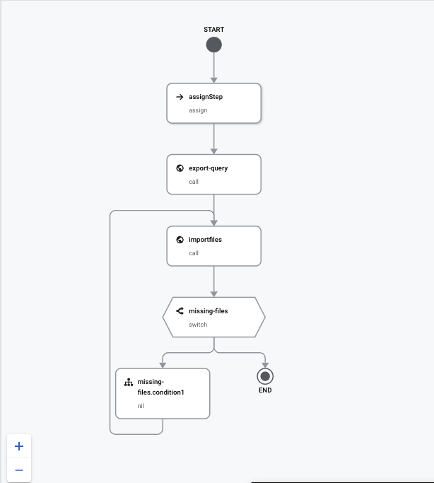
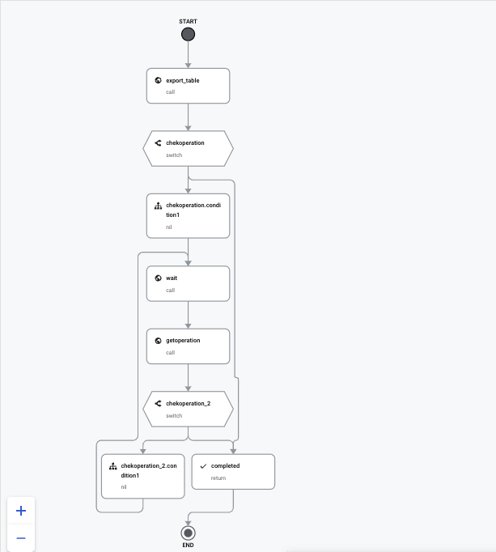
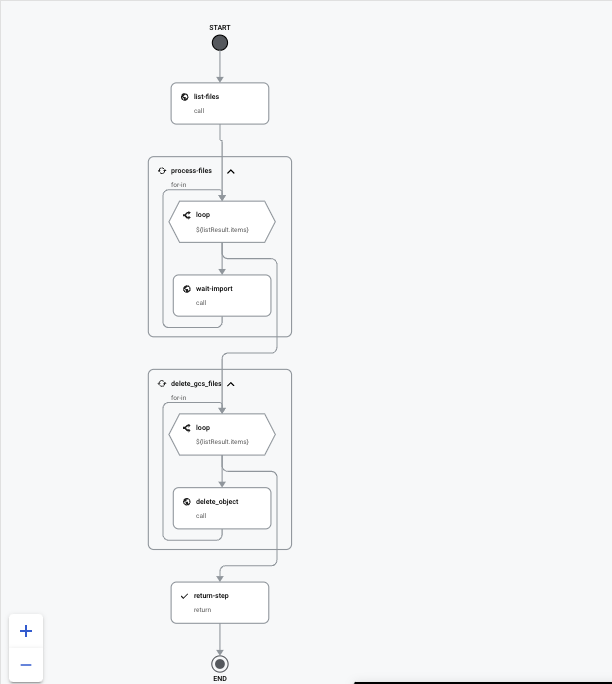
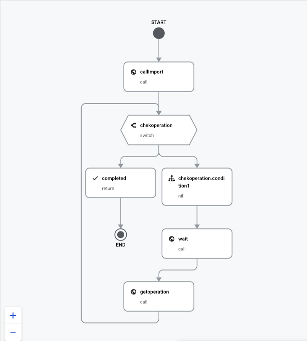

# Export BigQuery to Cloud SQL (MySQL)

Two options to export BigQuery to Cloud SQL (MySQL)

-   Via Workflow pipeline with internally call APIs
-   Via Airflow pipeline

## Workflow

Workflow has 3 main steps:

-   Export data to GCS first
-   Import data from GCS to Cloud SQL via Cloud SQL admin
-   Delete temporary data from GCS

